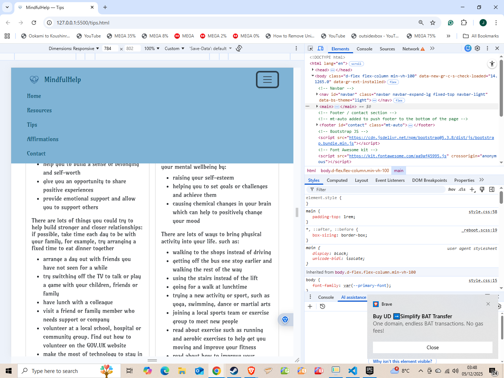
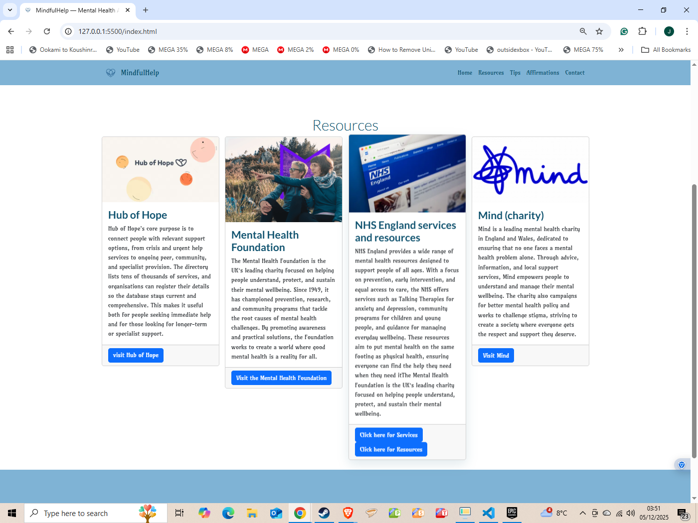
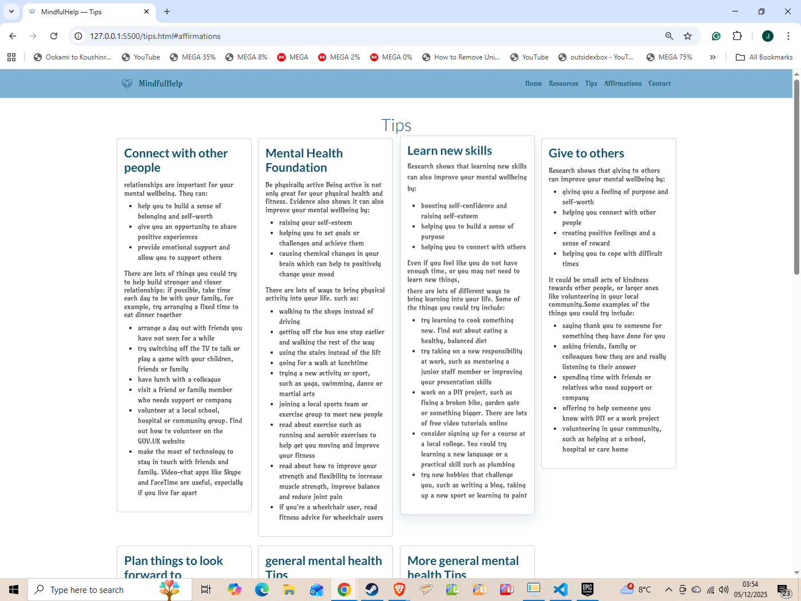
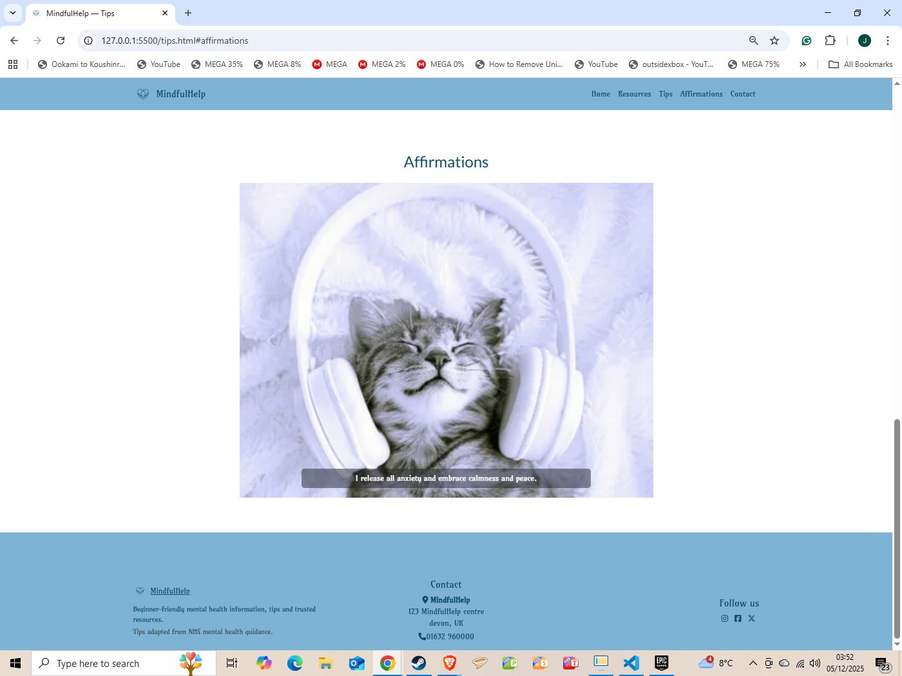

# MindfulHelp — Portfolio Project

**Live site:** https://joshuacottle.github.io/Portfolio-Project/

**Repository:** https://github.com/JoshuaCottle/Portfolio-Project

**Responsibility / Ownership**

-   Primary author: Joshua Cottle
-   Responsibilities: project structure, HTML/CSS layout, responsive styling, basic JavaScript for interactive components (carousel), image and asset management, accessibility and basic validation fixes.

**Example responsive image**

Breif
Project 4: Mental Health Awareness
External User’s Goal: The user seeks accessible, beginner-friendly information on mental health, including how to recognize common issues and manage stress, presented in a supportive and organised layout.

Site Owner’s Goal: The site owner wants to create a welcoming webpage that provides basic mental health information using a clean and supportive design. The focus is on using HTML and CSS with Bootstrap to create a calming and well-organised user experience.

Potential Features might Include:
Hero Section with Positive Messaging: A Bootstrap Jumbotron with an encouraging message about mental health, using a calming colour scheme and a simple background image.

Information Cards: Use Bootstrap’s card components to present mental health tips and common issues, providing a visually appealing way to organise content.

Resource Links: A grid layout for external links to mental health resources styled with Bootstrap buttons to make them stand out.
Positive Affirmations: Use Bootstrap’s text utilities to include a section with uplifting quotes or messages to encourage users.

**Contents**

-   `index.html` — Home / landing page
-   `tips.html` — Tips & Affirmations page with carousel
-   `contact.html`, `success.html` — contact and confirmation pages
-   `assets/css/style.css` — custom styles
-   `assets/images/` — image assets and favicons
-   `scripts/check-rel.js` — small Node script to enforce external link `rel` attributes

**UX**
USER STORIES
User story: As a User seeking quick guidance, I want concise information cards that present mental health tips and common issues, so I can scan and absorb practical advice easily.

    User story: As a First‑Time Visitor, I need easy navigation and a user‑friendly design, including a responsive layout for my device, so I can find mental health information quickly and efficiently without frustration.

    User story: As someone seeking help, I want a clear grid of vetted external resources with prominent buttons, so I can quickly access trusted organisations, hotlines, and further reading.

    User story: As a Visitor looking for encouragement, I want a short, scannable section of uplifting quotes or affirmations, so I can get a quick mood boost and feel supported.

    User story: As a Visitor seeking reassurance, I want a calming hero section with an encouraging headline and a short supportive message, so I immediately feel welcomed and understand the site’s purpose.

    User story: As a Site Owner and user with accessibility needs, I want the site to follow accessibility best practices and responsive design, so everyone can access information safely and comfortably.

-   Clear, calm layout intended for mental-health resources.
-   Simple navigation with prominent brand and quick access to Resources, Tips and Contact.
-   Large hero area and readable typography for accessibility.

    **Design**

-   Soft, approachable colour palette using CSS variables in `assets/css/style.css` for mental-health branding consistency.
    --primary-color: #0b4f6c; /_ deep teal / navy _/
    --secondary-color: #7fb3d5; /_ soft sky blue _/
    --highlight-color: #ffffff; /_ white _/
    --highlight-color-light: #7a9fc2; /_ light blue _/

-   Typography: clean, readable sans-serif fonts with strong hierarchy to support accessibility and user focus.
-   Imagery: calming, nature-inspired photography and illustrations aligned with wellness themes; optimized for fast loading and responsive display.
-   Responsive grid (Bootstrap 5) for cards and media queries for smaller screens.
-   Accessible markup (aria attributes on carousel and navigation) and visible captions on small screens.

**wireframes**

**Website features**

-   Responsive navbar with brand/logo
    
-   Hero image + overlaid cover text
    
-   Resources/tips card grid
    
    
-   Affirmations carousel with captions
    
-   Footer with contact info and social links
    
-   `scripts/check-rel.js` to scan and optionally fix external anchors missing `rel="noopener noreferrer"`

**Tablet / Mobile view**

-   Uses Bootstrap responsive breakpoints: cards stack vertically on small devices and display in a multi-column grid on larger screens.
-   Carousel images use `object-fit: cover` and viewport-based heights to remain visually consistent.
-   Navbar collapses into a hamburger menu for small screens.

**Future features (ideas)**

-   Add semantic HTML cleanup and validation fixes (move headings out of `
`, fix nested lists).
-   Add automated CI step to run `scripts/check-rel.js` and basic HTML validation.
-   Add light/dark theme toggle and persist preference.
-   Add unit/integration tests for any JS components.

**Technologies used**

-   HTML5, CSS3
-   Bootstrap 5 (CDN)
-   Minimal JavaScript (Bootstrap bundle + `scripts/check-rel.js` in Node)
-   Font Awesome for icons

**Deployment**

-   Hosted via GitHub Pages. Push to the `main` branch (or `gh-pages`) and enable Pages in repository settings.

**Testing**

## Testing

**Lighthouse Performance**

-   Mobile: 
-   Desktop: 

**W3C Validation**

-   CSS: 
-   HTML: 
    .

**AI Use**

-   **Content Generation**: AI tools assisted with drafting initial copy for tips, affirmations, and resource descriptions to support mental-health messaging.
-   **Code Assistance**: GitHub Copilot used for boilerplate HTML/CSS scaffolding, JavaScript function suggestions, and markdown formatting.
-   **Accessibility Review**: AI-powered linting and accessibility checks informed ARIA attribute placement and semantic HTML improvements.
-   **Image Optimization**: AI tools suggested responsive image strategies and lazy-loading approaches.

**Credits**

-   **Project Author**: Joshua Cottle
-   **Content Attribution**:
    -   **Tips content** ("Connect with other people", "Be physically active", "Learn new skills", "Give to others", "Plan things to look forward to", general mental health tips): Adapted from NHS mental health guidance and the "5 steps to mental wellbeing" framework. Original content © Crown copyright. Source: [NHS Mental Health Services](https://www.nhs.uk/mental-health/)
    -   **Resource descriptions** (Hub of Hope, Mental Health Foundation, NHS England, Mind): Original summaries based on publicly available information from the respective organizations
    -   **Affirmations**: Original content created for this project
-   **Organizations Featured**:
    -   [Hub of Hope](https://hubofhope.co.uk) - Mental health support directory
    -   [Mental Health Foundation](https://www.mentalhealth.org.uk/) - UK mental health charity
    -   [NHS England Mental Health Services](https://www.nhs.uk/nhs-services/mental-health-services/)
    -   [Mind](https://www.mind.org.uk) - Mental health charity
-   **Images**: Various sources (check `assets/images` filenames). Replace with properly licensed assets if publishing commercially.
-   **Frameworks & Libraries**: Bootstrap 5, Font Awesome icons

**code that inspired me**

        Navbar

 <!-- Navigation -->

    <nav id="navbar" class="navbar navbar-expand-lg fixed-top" data-bs-theme="dark">
        

            
            <button class="navbar-toggler" type="button" data-bs-toggle="collapse" data-bs-target="#navbarNav"
                aria-controls="navbarNav" aria-expanded="false" aria-label="Toggle navigation">
                
            </button>
            

                <ul class="navbar-nav ms-auto">
                    <li class="nav-item">
                        <a class="nav-link active" aria-current="page" href="index.html">Home</a>
                    </li>
                    <li class="nav-item">
                        <a class="nav-link" href="#services">Services</a>
                    </li>
                    <li class="nav-item">
                        <a href="#events" class="nav-link">Events</a>
                    </li>
                    <li class="nav-item">
                        <a class="nav-link" href="game-library.html">Games</a>
                    </li>
                    <li class="nav-item">
                        <a class="nav-link" href="#contact">Contact</a>
                    </li>
                    <li class="nav-item">
                        <a href="booking.html" class="btn custom-button-filled ms-lg-3">Book now</a>
                    </li>
                </ul>
            

        

    </nav>

    Carousel

    

                

                    

                        

                            
                        

                        

                            
                        

                        

                            
                        

                        

                            
                        

                        

                            
                        

                        

                            
                        

                    

                    <button class="carousel-control-prev" type="button" data-bs-target="#carouselExampleAutoplaying"
                        data-bs-slide="prev">
                        
                        Previous
                    </button>
                    <button class="carousel-control-next" type="button" data-bs-target="#carouselExampleAutoplaying"
                        data-bs-slide="next">
                        
                        Next
                    </button>
                

            

            Footer

            <!-- Footer / contact section -->
    <!-- mt-auto added to push footer to the bottom of the page -->
    <footer id="contact" class="mt-auto">
        

            

                

                    <h2 class="display-6">Contact us!</h2>
                

                <!-- Contact info -->
                

                    <h3 class="sub-heading-color">Contact info</h3>
                    <address>
                        <strong><i class="fa-solid fa-location-dot"></i> Boardwalk Games</strong> 
                        123 Boardwalk 
                        Boardwalk City, 12345
                    </address>
                    
<i class="fa-solid fa-phone"></i> 012 345 6789 
                        <i class="fa-regular fa-paper-plane"></i> info@boardwalk-games.co
                    

                    

                        <a href="https://www.instagram.com" target="_blank"
                            aria-label="Visit our Instagram page (opens in a new tab)" rel="noopener"><i
                                class="fa-brands fa-instagram"></i></a>
                        <a href="https://www.facebook.com" target="_blank"
                            aria-label="Visit our Facebook page (opens in a new tab)" rel="noopener"><i
                                class="fa-brands fa-square-facebook"></i></a>
                        <a href="https://www.x.com" target="_blank" aria-label="Visit our X feed (opens in a new tab)"
                            rel="noopener"><i class="fa-brands fa-x-twitter"></i></a>
                    

                

                cards

                  <!-- Services section -->
        <section id="services" class="container section">
            

                

                    <h2 class="display-6">Services</h2>
                

                

                    

                        
                        

                            <h3 class="card-title sub-heading-color">Play in our cafe</h3>
                            

                                Enjoy a relaxing atmosphere while diving into exciting board
                                games with friends. Indulge in our cosy café offerings, from
                                aromatic coffees to savory snacks.
                            

                        

                        

                            
€7 per person

                        

                    

                

                

                    

                        
                        

                            <!-- bootstrap cards come as h5 by default, changed to h3 to fit project heading hierarchy -->
                            <h3 class="card-title sub-heading-color">Game library</h3>
                            

                                Explore our collection of board games, ranging from classic
                                favorites to the latest releases. Find the perfect game for
                                any age, skill level, or interest.
                            

                        

                        

                            
See prices in store

                        

                    

                

                

                    

                        
                        

                            <h3 class="card-title sub-heading-color">Events</h3>
                            

                                Join us for special game nights, tournaments, and themed
                                events. A great opportunity to meet new people and test your
                                gaming skills.
                            

                        

                        

                            
From €5 per person

                        

                    

                

                

                    

                        
                        

                            <h3 class="card-title sub-heading-color">Kids parties</h3>
                            

                                Celebrate your child's special day with us! We offer fun,
                                game-filled party packages that are sure to delight young
                                gamers and their friends.
                            

                        

                        

                            
From €7 per child

                        

                    

                

            

        </section>

        Hero image

            <section id="hero">
            

                <h2>Love Running</h2>
                <h3>Dublin Docklands & Phoenix Park</h3>
            

        </section>

**Disclaimer**: This website is for educational purposes. The mental health tips and information are adapted from NHS guidance and other reputable sources but should not replace professional medical advice. If you're experiencing a mental health crisis, please contact emergency services or a crisis helpline immediately.
